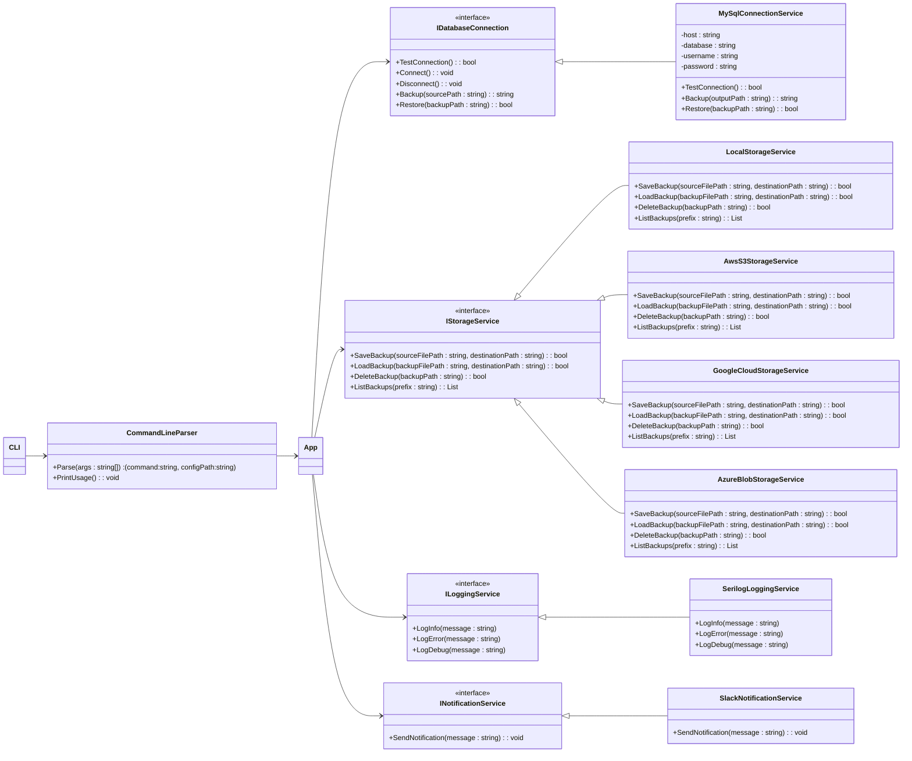
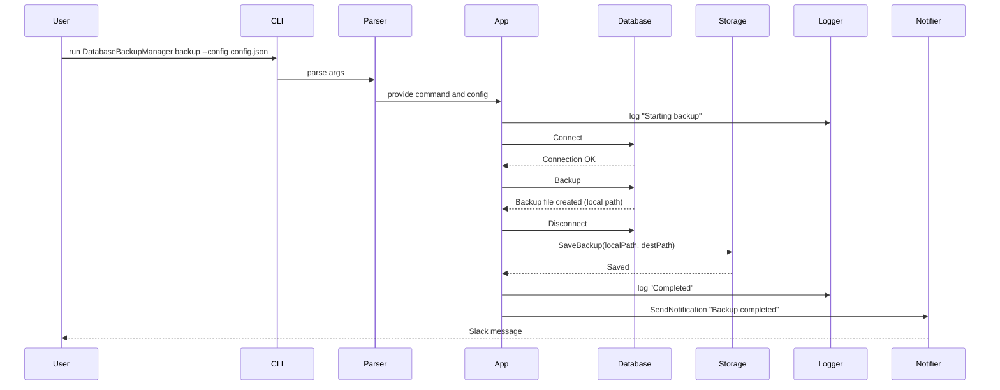

# DatabaseBackupManager

**DatabaseBackupManager** is a configurable command-line tool for creating and restoring database backups and storing them in various storage providers (local disk, Amazon S3, Google Cloud Storage, Azure Blob Storage).

---

## Table of Contents

* [Project Overview](#project-overview)
* [Features](#features)
* [Architecture](#architecture)

  * [Component Diagram (Mermaid)](#component-diagram-mermaid)
  * [Sequence Diagram (Mermaid)](#sequence-diagram-mermaid)
* [Code Structure / Key Files](#code-structure--key-files)
* [Getting Started](#getting-started)

  * [Prerequisites](#prerequisites)
  * [Build](#build)
  * [Example Config (`config.json`)](#example-config-configjson)
* [Usage](#usage)
* [Configuration Reference](#configuration-reference)
* [Design & Implementation Notes](#design--implementation-notes)
* [Extending the Project](#extending-the-project)
* [Logging, Notifications & Monitoring](#logging-notifications--monitoring)
* [Security Considerations](#security-considerations)
* [Troubleshooting](#troubleshooting)
* [CI / Deployment Suggestions](#ci--deployment-suggestions)
* [Contributing](#contributing)
* [License](#license)
* [Contact / Author](#contact--author)

---

## Project Overview

`DatabaseBackupManager` is intended to be a *simple, modular* backup manager that:

* Runs as a CLI application (commands: `backup`, `restore`).
* Supports multiple database types via a `IDatabaseConnection` interface.
* Uses storage provider abstractions (`IStorageService`) for saving/loading backup files.
* Integrates with logging (`ILoggingService`) and notifications (`INotificationService`) to provide observability.

The application is wired through dependency injection and driven by a JSON configuration file. The main goals are correctness, small surface for extension, and cross-cloud storage support.

---

## Features

* Backup and restore (via simple CLI: `backup` / `restore`).
* Database drivers (example included: MySQL). Designed to be extended with PostgreSQL, MongoDB, etc.
* Storage providers for Local Disk, Amazon S3, Google Cloud, Azure Blob Storage.
* Logging with Serilog (file + console).
* Optional Slack notifications via webhook.
* Command-line parsing and interactive selection of configured DB and storage provider.

---

## Architecture

The architecture follows a small, readable dependency-injection pattern. The main responsibilities are split into small interfaces so implementations can be swapped in or mocked for testing.

### Component Diagram (Mermaid)



### Sequence Diagram (Mermaid)



---

## Code Structure / Key Files

(High-level map of files present in the repository — these align with the implementation.)

* `Program.cs` — application bootstrap, DI container setup, configuration loading, entrypoint for `backup` and `restore` operations.
* `CommandLineParser.cs` — small utility to parse `backup` / `restore` command and `--config` option.
* `IDatabaseConnection.cs` — interface for DB-specific implementations.
* `MySqlConnection.cs` — MySQL implementation that uses `mysqldump` / `mysql` commandline tools to perform backup/restore.
* `MySqlBackup.cs` — backup service wrapper used by higher-level code.
* `IStorageService.cs` — interface for storage backends.
* `LocalStorageService.cs` — store to local filesystem.
* `AwsS3StorageService.cs` — store to Amazon S3.
* `SerilogLoggingService.cs` — Serilog wrapper; config-driven.
* `SlackNotificationService.cs` — simple HTTP webhook-based notifier.

(If other provider implementations exist in the repo, they follow the same pattern.)

---

## Getting Started

### Prerequisites

* [.NET SDK (7.0+ recommended)](https://dotnet.microsoft.com/)
* The database client tools for the corresponding backend on the machine where the CLI runs. For MySQL, `mysqldump` and `mysql` must be present and available on PATH.
* Cloud provider credentials for AWS / GCP / Azure to enable remote storage providers (Optional).

  * AWS: Access Key / Secret Key or instance IAM role.
  * GCP: Service Account JSON key file.
  * Azure: Storage connection string or Managed Identity.
* A JSON configuration file (sample below).

### Build

```bash
# from repository root
cd DatabaseBackupManager
dotnet build -c Release
```

or run directly (for development):

```bash
dotnet run --project DatabaseBackupManager -- backup --config ./config.json
```

### Example Config (`config.json`)

```json
{
  "Databases": [
    {
      "Type": "MySql",
      "DatabaseName": "my_database",
      "Host": "localhost",
      "Username": "dbuser",
      "Password": "s3cr3t"
    }
  ],
  "Storage": {
    "Type": "LocalStorage",
    "LocalPath": "./backups",
    "BucketName": "",
    "AccessKey": "",
    "SecretKey": "",
    "ConnectionString": "",
    "CredentialsFilePath": ""
  },
  "Logging": {
    "Path": "logs/log-.txt",
    "ConsoleEnabled": true,
    "RollingInterval": "Day",
    "RetainedFileCountLimit": 7
  },
  "Notifications": {
    "SlackWebhookUrl": "https://hooks.slack.com/services/XXX/YYY/ZZZ"
  }
}
```

Notes:

* The application will prompt interactively to select one of the configured `Databases` and one of the configured `Storage` types unless you wire that selection into automated code.
* `LocalPath` is used to create the temporary backup file; make sure it exists and the app has write permission.

---

## Usage

```bash
# Create a backup using a configuration file
dotnet run --project DatabaseBackupManager -- backup --config ./config.json

# Restore a backup (assumes backup file path is resolved in your configuration or interactive selection)
dotnet run --project DatabaseBackupManager -- restore --config ./config.json
```

The CLI supports two commands: `backup` and `restore`. Pass `--config <file>` to point to the JSON config.

Example full flow (MySQL):

* `Program.cs` builds a file path: `backup yyyyMMddHHmmss` under configured `LocalPath`.
* The MySQL implementation invokes `mysqldump` to export the database to that local path.
* The configured `IStorageService` uploads or copies that file to a permanent destination.
* Logging records progress and optional Slack notification is sent.

---

## Configuration Reference

* `Databases` — array of database entries. Each entry must contain `Type` and provider-specific fields.

  * For `MySql`: `Host`, `DatabaseName`, `Username`, `Password`.
* `Storage` — primary storage config. `Type` can be `LocalStorage`, `AmazonS3`, `GoogleCloud`, `AzureBlob`.

  * `LocalStorage` requires `LocalPath`.
  * `AmazonS3` requires `AccessKey`, `SecretKey`, `BucketName`.
  * `GoogleCloud` requires `CredentialsFilePath`, `BucketName`.
  * `AzureBlob` requires `ConnectionString`, `ContainerName`.
* `Logging` — Serilog file settings.
* `Notifications` — Slack webhook address.

(If you need to add multiple storage targets, you can extend the config and wiring in `Program.cs` to list many and add rules to pick one or run multiple.)

---

## Design & Implementation Notes

* **CommandLineParser** validates that the command is `backup` or `restore` and that `--config` exists. It also prints usage when invalid. (See `CommandLineParser.cs`.)
* **Database Connection** implementations (`IDatabaseConnection`) encapsulate connecting, backup, and restore. The MySQL implementation calls `mysqldump` and `mysql` via `Process` and captures stdout/stderr to the console.
* **Storage Services** implement `IStorageService` and are responsible for persisting backup files.
* **Logging** is provided by a `SerilogLoggingService` configured from `Logging` settings and writing to console/file.
* **Notifications**: `SlackNotificationService` posts to a configured Slack webhook using a simple JSON payload.

---

## Extending the Project

This project was deliberately structured for extension. Typical extension points:

1. **Add a new database type**

   * Implement `IDatabaseConnection` for the new database type (e.g., `PostgreSqlConnectionService`).
   * Add wiring in `Program.cs` to return the new implementation when the config `Type` matches.

2. **Add a new storage provider**

   * Implement `IStorageService` (e.g., `BackblazeB2StorageService`).
   * Wire it up in the DI container in `Program.cs` and add config fields.

3. **Add tests**

   * The design favors small interfaces that are easy to mock. Add xUnit/NUnit tests that mock `IDatabaseConnection` and `IStorageService` to test the orchestration in `Program.cs` or a higher-level orchestration class.

4. **Automate selection**

   * Instead of interactive `Console.ReadLine()` selection in `Program.cs`, allow selecting database and storage by index or explicit config path to enable non-interactive automation (CI, containers, scheduled jobs).

---

## Logging, Notifications & Monitoring

* **Serilog** writes both to console and to rolling files. Configure retention via `RetainedFileCountLimit`.
* **Slack** is supported via webhook for simple alerting. Consider adding richer notifications (email, PagerDuty) for production.

---

## Security Considerations

* **Secrets in config**: The repo currently shows passwords and cloud keys read from JSON config. For production, do not store secrets in plaintext files under version control. Prefer:

  * Environment variables (read via `IConfiguration`), or
  * Secret stores (AWS Secrets Manager, Azure Key Vault, Google Secret Manager), or
  * Use instance roles (IAM) instead of long-term access keys when running in cloud.
* **Least privilege**: Grant the minimal permissions for storage buckets and database users used for backups.
* **Network security**: If backups contain sensitive data, use server-side encryption on S3 / GCS / Azure and TLS in transit.

---

## Troubleshooting

* If `mysqldump` fails or the command is not found: ensure MySQL client tools are installed and available on PATH.
* Permission errors when writing to `LocalPath`: check user/role permissions.
* Cloud upload failures: verify credentials and bucket/container names; check region and endpoint settings if using S3.
* Logs: check configured log files (see `Logging:Path`) for detailed errors.

---

## CI / Deployment Suggestions

* Build a Docker image that contains necessary DB client tools (e.g., `mysql-client`) and the .NET runtime. Mount a volume or configure cloud credentials as secrets.
* Use a scheduler (cron / systemd timers / Kubernetes CronJob / AWS EventBridge) to orchestrate periodic backups.
* Keep retention policy and lifecycle rules on remote storage to avoid unbounded storage growth.

Example Systemd service (simple wrapper):

```ini
[Unit]
Description=DatabaseBackupManager daily backup

[Service]
Type=oneshot
WorkingDirectory=/opt/DatabaseBackupManager
ExecStart=/usr/bin/dotnet DatabaseBackupManager.dll backup --config /opt/DatabaseBackupManager/config.json

[Install]
WantedBy=multi-user.target
```

---

## Suggested Future Improvements

* Add automatic non-interactive run mode with `--db-index` and `--storage-index` flags.
* Add more database drivers implemented similarly to MySQL.
* Add a retention/rotation feature (delete old backups from storage based on age or count).
* Add encryption of backup files before uploading.
* Add integration tests and unit tests.

---

## Contributing

Contributions are welcome! Please open issues for feature requests or bugs, and submit pull requests with clear descriptions.

Guidelines:

* Add unit tests for new functionality where reasonable.
* Keep changes small and focused.
* Use meaningful commit messages.

---

## License

This project is provided under the MIT License.

---

## Contact / Author

If you'd like to discuss this project or report issues, open a GitHub issue or contact the maintainer listed in the repository.

---